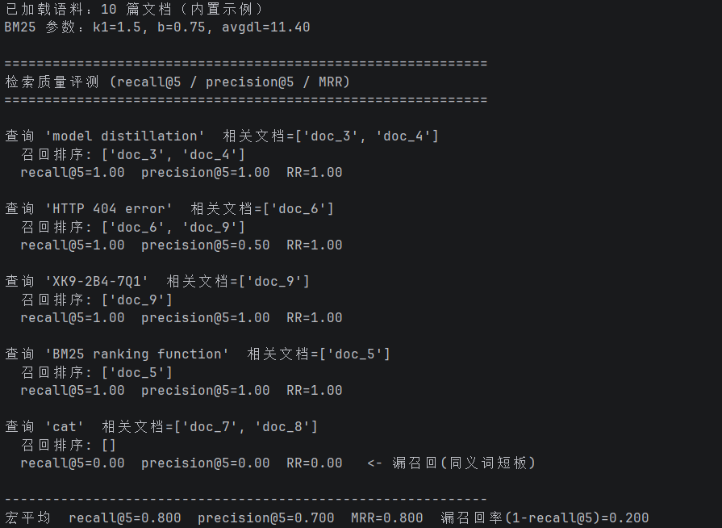
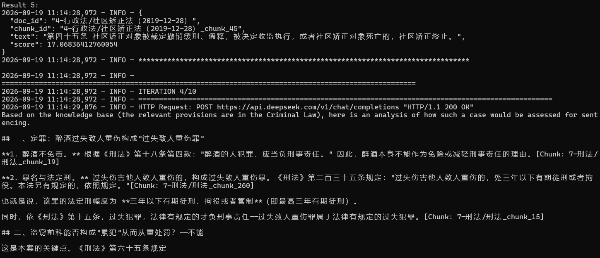
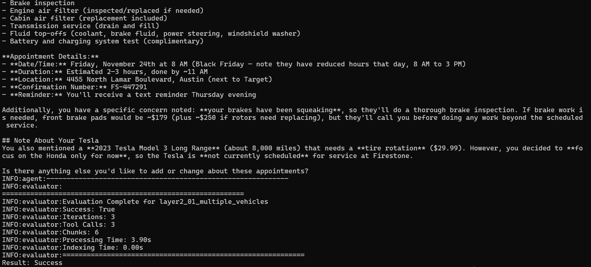

# AI Agent Book 共学笔记：检索、Agentic RAG 与用户记忆

本次学习围绕《深入理解 AI Agent》第 3 章展开，记录实验 3-5、3-8 和 3-9。三个实验分别对应“怎样找资料”“怎样主动查资料”“怎样从历史对话中找回信息”，共同帮助理解 Context、Memory 与 RAG 的关系。

本文截图均提取自我的《实验截图.docx》，结果以截图实际显示的内容为准。命令使用原仓库的 `cli.py`、`main.py` 入口，不使用额外编写的实验脚本。这里记录的是基础检索评测及选定问答、记忆用例的运行，不将其表述为全套基准评测。

## 一、环境配置

### 1. 进入仓库并指定 Python 环境

本机使用 Windows PowerShell。以下路径对应本次实验的工作目录和已安装依赖的 Python 环境：

```powershell
cd "C:\Users\32586\Documents\Codex\2026-09-19\z-m\ai-agent-book"

$repo = (Get-Location).Path
$py = "C:\Users\32586\Documents\Codex\2026-09-19\z-m\work\experiment-venv\Scripts\python.exe"

$env:PYTHONPATH = $repo
$env:PYTHONUTF8 = "1"
$env:PYTHONIOENCODING = "utf-8"

& $py --version
```

拆开理解：

- `cd`：切换当前文件夹。
- `$repo`：记录仓库根目录，后续进入不同实验目录时可以复用。
- `$py`：指定已安装实验依赖的 Python，避免误用其他环境。
- `& $py`：PowerShell 使用 `&` 执行变量中保存的程序路径。
- `PYTHONPATH`：让 Python 能找到仓库中的共享模块。
- `PYTHONUTF8`、`PYTHONIOENCODING`：使用 UTF-8，减少中文终端输出乱码。
- `--version`：只检查 Python 版本，不启动实验。

这些环境变量只作用于当前终端及随后启动的程序。换一台电脑时，需要调整路径；如果依赖尚未安装，应按对应实验 README 配置环境。

### 2. 配置 DeepSeek

实验 3-5 的 BM25 评测完全离线，不需要 API Key；实验 3-8 和 3-9 的回答生成需要模型服务。

```powershell
$env:DEEPSEEK_API_KEY = [System.Net.NetworkCredential]::new("", (Read-Host "输入 DeepSeek API Key" -AsSecureString)).Password
$env:LLM_PROVIDER = "deepseek"
$env:LLM_MODEL = "deepseek-flash"
```

`Read-Host -AsSecureString` 让密钥输入不直接显示在终端。设置变量没有输出是正常的，并不代表已经调用模型。下面的运行命令还会通过 `--provider` 和 `--model` 明确指定服务商与模型；如果账号可用模型不同，需要填写实际支持的模型名称。

## 二、实验 3-5：从零实现 BM25 搜索引擎

### 1. 实验目的

理解稀疏检索如何根据关键词找出相关文档，并观察它在精确匹配和同义表达上的差异。

BM25 根据词频、逆文档频率和文档长度计算相关性分数。简单来说，查询词出现在文档中会带来匹配贡献；较少见的词通常更有区分度；同时还需要考虑文档长度，避免长文档仅因词多而占优势。

### 2. 运行原始入口

```powershell
cd "$repo\chapter3\sparse-embedding"
& $py cli.py --eval
```

- `cli.py`：仓库提供的离线检索入口。
- `--eval`：对内置的带标注查询进行评测，而不是只展示一条搜索结果。
- 默认语料包含 10 篇文档，检索参数为 `k1=1.5`、`b=0.75`、`top-k=5`。

如果想进一步查看某次搜索的 TF、IDF 和 BM25 分数贡献，可以执行：

```powershell
& $py cli.py -q "model distillation" --explain
```

其中 `-q` 指定查询，`--explain` 展示评分细节。下面的截图对应前面的 `--eval` 评测。

### 3. 运行截图



### 4. 输出解读

| 查询                      | 返回文档            | Recall@5  | 程序显示的 Precision@5 | RR              |
| ----------------------- | --------------- | ---------:| -----------------:| ---------------:|
| `model distillation`    | `doc_3`、`doc_4` | 1.00      | 1.00              | 1.00            |
| `HTTP 404 error`        | `doc_6`、`doc_9` | 1.00      | 0.50              | 1.00            |
| `XK9-2B4-7Q1`           | `doc_9`         | 1.00      | 1.00              | 1.00            |
| `BM25 ranking function` | `doc_5`         | 1.00      | 1.00              | 1.00            |
| `cat`                   | 空列表             | 0.00      | 0.00              | 0.00            |
| **宏平均**                 | —               | **0.800** | **0.700**         | **MRR = 0.800** |

这几个指标分别表示：

- **Recall@5**：前 5 个返回结果找回了多少已标注的相关文档。
- **Precision@5**：返回结果中相关文档所占的比例。这里代码以“实际返回条数”为分母，返回不足 5 条时不补齐，因此不是固定除以 5。
- **RR**：第一个相关结果排名的倒数；相关文档排第 1 时为 1，没有相关结果时为 0。
- **MRR**：各查询 RR 的平均值。
- **宏平均**：每条查询的指标等权平均，不是把所有文档合并后计算一次。

`HTTP 404 error` 返回了两篇文档，但标注中只有 `doc_6` 相关，因此召回率为 1，精确率为 0.5。它说明“相关文档找到了”和“返回结果都相关”是两回事。

`cat` 的相关文档使用的是 `kitten`、`feline`，没有出现字面上的 `cat`，结果一个也没召回。内置分词和 BM25 匹配不会自动把这些词视为同义词。

### 5. 学习理解

这个实验让我看到，检索不仅要把文档存起来，还要解决“用户怎么问”和“文档怎么写”之间的差异。BM25 对明确关键词、错误码比较有效，但同义表达可能导致漏召回。对 RAG 来说，如果关键资料没有被找回，就不能通过这条检索路径进入当前上下文，后续生成也就缺少这部分依据。

本实验验证的是检索环节，没有调用大模型生成答案，也没有测试跨会话记忆。

## 三、实验 3-8：Agentic RAG 与普通 RAG 对比

### 1. 实验目的

理解普通 RAG 的单次检索与 Agentic RAG 的自主多轮检索有什么不同。

- **普通 RAG**：问题 → 检索一次 → 将结果加入上下文 → 生成回答。
- **Agentic RAG**：问题 → 模型决定检索内容 → 执行检索 → 将结果加入上下文 → 判断是否需要继续检索 → 生成回答。

区别在于模型能否根据已有证据继续决定下一步查什么，而不只是最终答案写得长不长。

### 2. 运行原始入口

```powershell
cd "$repo\chapter3\agentic-rag"

& $py main.py --provider deepseek --model deepseek-flash --kb-type offline --mode compare --query "醉酒过失致人重伤且有盗窃前科如何量刑"
```

参数含义：

- `--provider deepseek`：使用 DeepSeek 服务。
- `--model deepseek-flash`：明确使用的模型。
- `--kb-type offline`：使用内置本地 BM25 和法律文档，不启动额外的检索服务器；生成回答仍然调用 API。
- `--mode compare`：对同一问题先运行普通 RAG，再运行 Agentic RAG。
- `--query`：指定实验问题。这道题来自教材实验 3-8，原 README 和程序帮助中也有对应命令，并非临时另拟的问题。

### 3. 运行截图



### 4. 输出解读

截图中有三类值得关注的信息：

| 输出                                            | 含义                                         |
| --------------------------------------------- | ------------------------------------------ |
| `Result 5`、`doc_id`、`chunk_id`、`text`、`score` | 检索返回的一个文档片段、来源标识及检索分数                      |
| `ITERATION 4/10`                              | Agent 到达第 4 轮迭代，最多允许 10 轮；不等于恰好调用了 4 次检索工具 |
| `HTTP/1.1 200 OK`                             | 本轮模型请求成功返回；不等于答案已通过事实核验                    |
| `[Chunk: ...]`                                | 回答引用了知识库中的片段编号，便于回查证据                      |

可以看到，系统先获得检索片段，再调用 DeepSeek，随后开始围绕问题生成分析，并标注刑法文档的片段来源。这里体现了“检索结果作为工具反馈进入 Context，再参与回答生成”的过程。

截图顶部的一条检索结果来自社区矫正相关文档，也提醒我：返回结果并不一定都能直接解决当前问题。需要结合问题筛选、补充证据，而不是把检索到的每一段都当作有效结论。

### 5. 结果边界与学习理解

这张截图保留了 Agentic RAG 的部分迭代过程和回答，但没有同时完整展示普通 RAG 与 Agentic RAG 的两份回答，也没有给出统一评分。因此，它能够支持“模型执行了多轮流程并使用检索材料作答”，不能单独证明“Agentic RAG 比普通 RAG 更准确”。

回答有引用也不等于引用准确。还需要检查被引用片段是否真的支持对应说法，不能只凭编号就判断正确。本文只分析实验流程，不把模型生成的法律表述作为经过核实的法律结论。

我对这个实验的理解是：Agentic RAG 将检索从固定步骤变成可以继续决策的工具调用过程。它有机会补齐第一次检索遗漏的信息，但也可能增加调用次数和耗时。判断效果应看证据是否充分、回答是否满足问题，而不能只看输出长度或迭代轮数。

## 四、实验 3-9：利用 Agentic RAG 构建用户记忆

### 1. 实验目的

观察系统怎样从历史对话中找回用户信息，并区分相似对象及不同的状态。

本次用例为 `layer2_01_multiple_vehicles`，涉及多辆车的服务安排。用户询问已预约的服务，系统需要区分“已经安排好的 Honda 保养”与“提到有需求、但尚未预约的 Tesla 服务”。

### 2. 运行原始入口

```powershell
cd "$repo\chapter3\agentic-rag-for-user-memory"

& $py main.py --mode batch --test-id layer2_01_multiple_vehicles --provider deepseek --model deepseek-flash --backend local --index-mode sparse
```

参数含义：

- `--mode batch`：使用评测运行方式，不进入交互菜单。
- `--test-id`：只运行指定的原始用例，不是整个评测集。
- `--backend local`：使用本地检索后端。
- `--index-mode sparse`：使用稀疏检索。
- `--provider`、`--model`：指定生成回答所用的服务商与模型。

历史对话先分块并建立可检索索引；模型需要细节时调用记忆检索工具，程序把找回的片段加入上下文，模型再组织回答。历史对话存入索引，并不等于所有内容已经进入本轮 Context。

### 3. 运行截图



### 4. 输出解读

截图中的模型回答列出了预约时间、地点、服务内容和确认编号。其中可直接看到：

- 预约时间为 11 月 24 日星期五上午 8 点。
- 预计用时 2—3 小时。
- 预约确认编号为 `FS-447291`。
- Tesla 有轮胎换位需求，但当前没有在 Firestone 安排服务。

这些内容来自教材用例中的历史对话，不是我本人的真实车辆或预约信息。其关键是区分“提到需求”与“已经完成预约”，而不只是记住两辆车的名称。

截图末尾的运行指标如下：

| 指标                | 截图结果   | 理解                           |
| ----------------- | ------:| ---------------------------- |
| `Success`         | `True` | 程序报告成功；是否代表答案评分通过，要结合评分器日志判断 |
| `Iterations`      | 3      | 本次进行了 3 轮推理                  |
| `Tool Calls`      | 3      | 本次执行了 3 次工具调用                |
| `Chunks`          | 6      | 本次用例对应 6 个记忆块，不等于每轮全部送入模型    |
| `Processing Time` | 3.90 s | 程序记录的处理时间                    |
| `Indexing Time`   | 0.00 s | 显示精度下为 0.00 秒，不能据此断言索引没有成本   |

原代码在没有独立评分结果时，可以沿用 Agent 的流程成功标志。因此，截图中的 `Success: True` 不能直接换算成“准确率 100%”。这张截图没有独立评审分数，本次只据此记录流程完成与回答内容。

### 5. 学习理解

用户记忆不只是把聊天记录存下来，还要在需要时找回相关信息，并识别信息属于谁、是否已经确认、有没有发生变化。这个实验中，Honda 和 Tesla 都与车辆服务有关，但服务状态不同；混淆“想预约”和“已预约”就会生成错误回答。

模型并不是永久记住了这些历史对话，而是由程序保存对话、建立索引，再按需要把检索结果放进当前上下文。这里的 RAG 检索对象从公共知识库变成了用户历史对话，但“检索—加入上下文—生成回答”的基本过程相同。

## 五、Context、Memory 与 RAG 的关系

Context（上下文）是模型本轮推理直接接收的信息，包括系统指令、用户问题、对话历史和工具结果，受上下文窗口容量限制。Memory（记忆）是保存和更新历史信息的机制，其中长期记忆可跨会话保留用户偏好、事实和经验。RAG（检索增强生成）通过检索知识库或记忆，将相关内容加入 Context，辅助模型生成回答。三者关系是：Memory 提供可持续积累的信息，RAG 按需取回相关内容，Context 承载本轮推理所需的信息。记忆只有被读取并纳入上下文，才能直接影响当前回答；RAG 也可检索外部知识，并不局限于用户记忆。

```text
用户问题 ──────────────────────────┐
                                  ↓
知识库 / 历史记忆 → 检索相关片段 → 当前 Context → 模型回答
                                  ↑
                    系统指令 / 选入的历史 / 工具结果
```

图中“检索相关片段到生成回答”的过程体现了 RAG；持久保存的用户历史及其管理属于 Memory；最终实际发送给模型的内容属于 Context。

## 六、学习心得

这三个实验让我把“检索”和“记忆”联系起来。3-5 说明了关键词检索的基本机制，也暴露了同义表达导致漏召回的问题；3-8 展示了 Agent 如何根据已有证据继续检索；3-9 则把同样的检索思路用到了用户历史对话上。

我最大的收获是，系统里保存了信息，不代表模型当前就知道；工具返回了结果，也不代表结果一定相关；程序打印成功，更不代表答案已经验证正确。分析实验时，需要沿着“查了什么、返回了什么、哪些信息进入了上下文、最终回答是否有依据”去看完整过程。

从 Agent 的组成来看，LLM 负责理解问题、决定下一步行动和组织回答，Context 提供本轮可用信息，Tools 负责实际检索；Memory 让信息跨会话保留，RAG 让大量存储内容中的相关部分被按需使用。各部分配合起来，才能形成既能处理当前任务、又能利用历史信息的助手。
