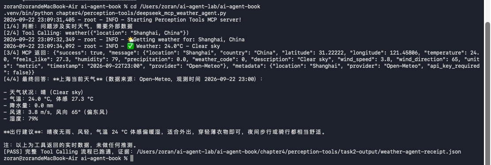

# Task 2｜Tools 与 MCP：DeepSeek + MCP Weather Tool

> 学习内容：Chapter 4 Tools 与 MCP  
> 实验项目：`chapter4/perception-tools`  
> 实验日期：2026-09-22  
> 实验结果：成功

## 1. 为什么选择这个实验

本次只选择一个最适合打卡的实验：让 DeepSeek 根据用户问题自主判断是否需要实时数据，通过 MCP 调用 `weather` 工具，取得 Open-Meteo 的真实天气数据，再生成最终回答。

这个实验覆盖了 Task 2 要求中的四个关键点：

1. 理解 Agent 为什么需要 Tools：模型自身不知道当前天气，需要通过工具连接外部世界。
2. 理解 Function Calling / Tool Calling：DeepSeek 输出工具名称和结构化参数。
3. 理解 MCP：Agent 不直接调用天气函数，而是通过 MCP Client、stdio transport 和 MCP Server 完成工具发现与执行。
4. 跑通“判断 → 调用工具 → 获取结果 → 回答”的完整闭环。

项目资料：

- [第 4 章实验目录](https://github.com/bojieli/ai-agent-book/blob/main/chapter4/README.md)
- [perception-tools 实验说明](https://github.com/bojieli/ai-agent-book/tree/main/chapter4/perception-tools)

## 2. 实验结构

```text
用户问题
   ↓
DeepSeek 判断需要当前天气
   ↓  Function Calling
weather(location="Shanghai, China")
   ↓  MCP stdio
Perception Tools MCP Server
   ↓
Open-Meteo API 返回实时天气
   ↓  Tool Result
DeepSeek 根据真实结果生成中文回答
```

三个组成部分分别是：

- LLM：`deepseek-v4-flash`，负责理解问题、选择工具和组织最终回答。
- MCP Client：把 MCP 工具 schema 转换为 DeepSeek 可识别的 Function Calling schema，并把模型的工具请求转发给 MCP Server。
- MCP Server：项目自带的 `perception-tools/src/main.py`，负责暴露 `weather` 工具并调用 Open-Meteo。

## 3. 环境准备

我复用了仓库根目录的 `.venv`，安装 `perception-tools` 的依赖：

```bash
cd /Users/zoran/ai-agent-lab/ai-agent-book
UV_CACHE_DIR=/private/tmp/ai-agent-book-uv-cache \
  uv pip install --python .venv/bin/python \
  -r chapter4/perception-tools/requirements.txt
```

本次关键版本：

```text
MCP SDK: 2.2.0
MCP Protocol: 2026-07-28
MCP Server: perception-tools
MCP Tool Count: 127
```

先运行项目自带的 MCP smoke test：

```bash
.venv/bin/python chapter4/perception-tools/smoke_test_mcp_v2.py
```

输出：

```text
MCP smoke test passed: sdk=2.2.0, protocol=2026-07-28,
server=perception-tools, tools=127
```

这一步证明 MCP Server 能通过 stdio 启动、完成协议协商、列出工具并执行调用。

## 4. DeepSeek + MCP Weather Agent

实验脚本：[`deepseek_mcp_weather_agent.py`](deepseek_mcp_weather_agent.py)

脚本只向 DeepSeek 暴露一个 `weather` 工具，便于清楚观察完整决策过程。用户问题为：

```text
请查询 Shanghai, China 当前天气，并根据温度、降水和风速给出一句简短的出行建议。
```

运行命令：

```bash
.venv/bin/python chapter4/perception-tools/deepseek_mcp_weather_agent.py
```

## 5. 运行结果



本次实际工具调用：

```text
[1/4] 判断：问题涉及实时天气，需要外部数据
[2/4] Tool Calling：weather({"location": "Shanghai, China"})
[3/4] MCP 返回：success=true，temperature=24.0°C，precipitation=0.0，wind_speed=3.8
[4/4] 最终回答：DeepSeek 根据工具结果给出天气信息和出行建议
[PASS] 完整 Tool Calling 流程已跑通
```

工具返回的关键数据：

| 字段 | 结果 |
|---|---:|
| 地点 | Shanghai, China |
| 天气 | Clear sky |
| 温度 | 24.0 °C |
| 体感温度 | 27.3 °C |
| 湿度 | 79% |
| 降水 | 0.0 mm |
| 风速 | 3.8 m/s |
| 数据源 | Open-Meteo |

DeepSeek 最终回答中明确引用工具数据，并给出“穿轻薄透气衣物、注意补水”的出行建议。原始运行证据保存在（截图为本人终端真实运行截图）：

- [`evidence/weather-agent-success.log`](evidence/weather-agent-success.log)
- [`evidence/weather-agent-receipt.json`](evidence/weather-agent-receipt.json)

## 6. 一次完整的 Tool Calling 流程

1. **判断**：DeepSeek 读取问题，识别到“当前天气”属于实时信息，不能只靠模型参数中的旧知识回答。
2. **选择工具**：模型在提供的工具 schema 中选择 `weather`，并生成结构化参数 `{"location": "Shanghai, China"}`。
3. **MCP 调用**：客户端把工具名和参数通过 MCP stdio transport 发送给 `perception-tools` Server。
4. **执行工具**：MCP Server 先通过 Open-Meteo 地理编码获得上海经纬度，再查询当前天气。
5. **返回观察结果**：MCP Server 返回统一的 JSON 结果，包括温度、体感温度、湿度、降水、风速和数据来源。
6. **生成回答**：客户端将 Tool Result 作为 `tool` 消息加入上下文，DeepSeek 基于真实观察结果生成最终答案。

这个过程说明 Function Calling 解决的是“模型如何表达调用意图”，MCP 解决的是“客户端如何用统一协议发现并执行外部工具”。二者配合后，Agent 才能形成“思考—行动—观察—回答”的闭环。

## 7. 遇到的问题

第一次运行时，DeepSeek 传入中文地点 `上海`。Open-Meteo 英文地理编码没有找到地点，MCP 传输虽然成功，但工具业务结果为 `success=false`。

处理方式：

- 在问题中明确使用 `Shanghai, China`；
- 在实验脚本中增加业务结果校验，只有 MCP 传输没有报错且工具 JSON 中 `success=true` 时才输出 `[PASS]`。

修正后实验成功。这也让我认识到，判断工具调用是否成功不能只看程序有没有异常，还要检查工具返回的业务状态。

## 8. 学习心得

我对 Tools 与 MCP 最直观的理解是：LLM 负责判断和生成行动参数，Tool 负责获取真实信息，MCP 则规定 Agent 与工具之间如何连接和交换结构化数据。没有天气工具时，模型只能依靠旧知识猜测；接入工具后，它能获得当前数据再回答。工具结果还会重新进入 Context，影响模型下一步决策，因此一次完整的 Agent 工作流不是单次问答，而是“判断 → 调用 → 观察 → 再回答”的循环。

本次实验还说明“调用接口成功”不等于“任务成功”。第一次 MCP 通信是正常的，但地点参数不被数据源识别，业务结果仍然失败。只有同时检查调用参数、工具返回状态和最终回答，才能确认 Agent 真正完成了任务。

