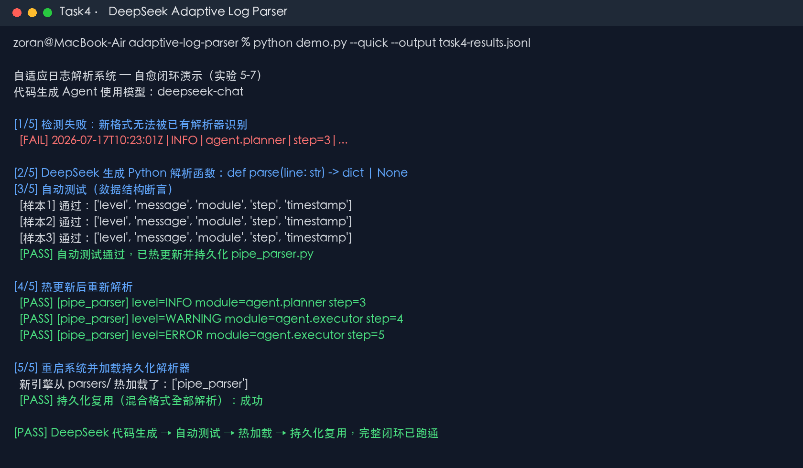

# Task 4｜Coding Agent 与通用 Agent

> 学习章节：第 5 章「Coding Agent 与通用 Agent」  
> 实验：Adaptive Log Parser 在线快速实验  
> 模型：DeepSeek `deepseek-chat`  
> 实验结果：成功

## 1. 实验选择

本次选择第 5 章的 **Adaptive Log Parser（自适应日志解析器）**。它比完整 Coding Agent 工程更容易运行，但保留了 Coding Agent 最关键的闭环：系统发现已有代码无法处理新输入后，把失败样本交给 LLM；LLM 生成新的 Python 代码；系统自动测试代码；测试通过后热加载并持久化；重启后继续复用新能力。

- [第 5 章正文](https://github.com/bojieli/ai-agent-book/blob/main/book/chapter5.md)
- [第 5 章实验目录](https://github.com/bojieli/ai-agent-book/blob/main/chapter5/README.md)
- [原实验说明](https://github.com/bojieli/ai-agent-book/tree/main/chapter5/adaptive-log-parser)

## 2. 实验目标

系统最初只会解析 JSON 日志。面对下面这种新格式时，已有解析器会失败：

```text
2026-07-17T10:23:01Z|INFO|agent.planner|step=3|Generated plan with 5 actions
```

实验要求 Agent 自动生成 `parse(line)` 函数，并完成以下流程：

```text
检测解析失败
    ↓
把失败样本和字段要求交给 DeepSeek
    ↓
DeepSeek 生成 Python 解析器
    ↓
3 条样本自动测试
    ↓
测试通过后热加载并持久化
    ↓
重启引擎，直接复用已学会的解析器
```

## 3. 环境与运行方式

实验使用仓库根目录的 Python 虚拟环境和现有 DeepSeek API 配置。API Key 只从本机环境读取，没有写入代码、日志或提交文件。

运行方式：

```bash
cd chapter5/adaptive-log-parser
OPENAI_BASE_URL=https://api.deepseek.com \
MODEL=deepseek-chat \
python demo.py --quick --output task4-results.jsonl
```

`--quick` 只处理一种新日志格式，能用一次真实 LLM 调用完成第 5 章闭环，适合本次打卡。

## 4. 运行结果



实际运行结果：

1. 初始 JSON 解析器成功处理基础日志。
2. 竖线分隔的新格式解析失败，触发自愈流程。
3. DeepSeek `deepseek-chat` 生成新的 `parse(line)` Python 函数。
4. 生成代码一次通过 3 条样本的结构化断言测试。
5. 系统将解析器热加载为 `pipe_parser`，随即成功解析 3 条新格式日志。
6. 新建解析引擎后，从磁盘重新加载 `pipe_parser`，无需再次调用 LLM，持久化复用成功。

关键输出：

```text
代码生成 Agent 使用模型：deepseek-chat
[样本1] 通过
[样本2] 通过
[样本3] 通过
✅ 自动测试通过，已热更新注册解析器 'pipe_parser'
新引擎从 parsers/ 热加载了：['pipe_parser']
持久化复用（混合格式全部解析）：成功
```

## 5. Coding Agent 工作流程分析

这个实验中的 Coding Agent 不只是输出一段代码文本，而是完成了可验证的行动循环：

- **观察环境**：发现新日志无法被任何已有解析器处理。
- **形成任务**：把失败样本、错误信息和必需字段组成代码生成请求。
- **生成代码**：DeepSeek 写出符合统一接口的 `parse(line)` 函数。
- **执行验证**：系统动态加载代码，并用 3 条样本检查字段是否完整、值是否为空。
- **改变环境**：测试通过后注册解析器，立即扩展系统能力。
- **保存成果**：将生成代码写入磁盘，重启后仍可复用。

因此，Coding Agent 与普通问答模型的主要区别是：它产生可执行制品，并通过测试结果判断任务是否真正完成。测试相当于环境反馈；如果测试失败，失败报告会进入下一轮上下文，Agent 再生成修正版代码。

## 6. 学习心得

通过这个实验，我理解到 Coding Agent 的价值不只是“会写代码”，而是能够围绕代码形成“观察问题—生成修改—运行测试—根据反馈修复—保存结果”的完整闭环。LLM 生成的代码具有不确定性，所以不能把模型说“已经完成”当作成功标准，必须让环境执行代码，并用测试验证实际行为。本次 DeepSeek 生成的解析器一次通过 3 条样本测试，随后被热加载并在新引擎中复用，说明 Agent 的输出已经从文字建议转化成了系统真实可用的新能力。

这个实验也让我看到通用 Agent 的基本结构：模型负责推理和生成行动，工具负责写入、执行和测试，环境反馈决定下一步。只要把任务接口、验证标准和权限边界设计清楚，同一种 Agent 循环就能扩展到修复代码、处理数据或维护软件系统等更多场景。

## 7. 文件说明

| 文件 | 内容 |
|---|---|
| [`src/agent.py`](src/agent.py) | 调用 DeepSeek 生成解析代码 |
| [`src/demo.py`](src/demo.py) | 串联失败检测、生成、测试、热加载和复用 |
| [`src/engine.py`](src/engine.py) | 日志解析引擎与解析器注册机制 |
| [`src/tester.py`](src/tester.py) | 自动测试生成代码 |
| [`generated/pipe_parser.py`](generated/pipe_parser.py) | DeepSeek 实际生成并通过测试的代码 |
| [`evidence/task4-run.log`](evidence/task4-run.log) | 完整真实运行日志 |
| [`evidence/task4-results.jsonl`](evidence/task4-results.jsonl) | 持久化复用后的结构化结果 |
| [`evidence/task4-receipt.json`](evidence/task4-receipt.json) | 结构化实验凭证与代码哈希 |
