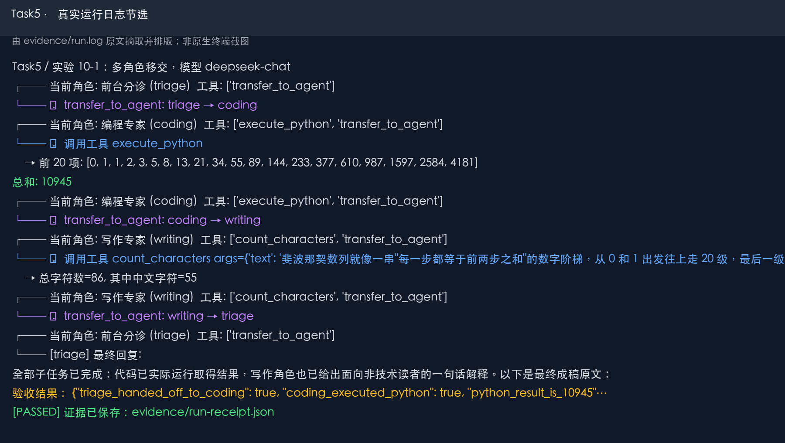

# Task 5｜多 Agent 协作：共享上下文中的多角色移交

> 学习章节：第 10 章「多 Agent 协作」  
> 对应实验：[10-1 multi-role-transfer](https://github.com/bojieli/ai-agent-book/tree/main/chapter10/multi-role-transfer) 的 coding 场景  
> 实验日期：2026-10-02（北京时间）  
> 实际模型：DeepSeek API 的 `deepseek-chat`  
> 结果：**通过；7/7 项验收条件满足**

## 1. 为什么选这个实验

第 10 章讨论多个 Agent 如何分工、交换上下文和移交控制权。本次选择代码仓库自带的 **10-1 多角色移交**，让三个专业角色协作完成一个不依赖外部搜索的任务：计算斐波那契数列前 20 项及总和，再向非技术读者解释。它只需要现有的 DeepSeek API，便于在截止前跑通，也能清楚观察角色、工具和历史轨迹怎样衔接。

学习资料：[第 10 章正文](https://github.com/bojieli/ai-agent-book/blob/main/book/chapter10.md) · [第 10 章实验索引](https://github.com/bojieli/ai-agent-book/blob/main/chapter10/README.md)

## 2. 实验任务和角色

用户任务是：编写并运行 Python，计算从 `0、1` 开始的斐波那契数列前 20 项及其总和，再用一句话解释结果。

| 角色 | 职责 | 可用的专业工具 |
|---|---|---|
| `triage` 前台分诊 | 拆分需求，移交任务，最后收尾 | `transfer_to_agent` |
| `coding` 编程专家 | 写代码并真实运行 | `execute_python` |
| `writing` 写作专家 | 将结果改写成通俗的一句话 | `count_characters` |

编排器对每个角色切换系统提示词和可见工具，同时保留同一段 `user/assistant/tool` 历史。这里展示的是**共享上下文的顺序协作**，不声称多个独立进程并行工作。

## 3. 实际运行和结果

完整日志：[evidence/run.log](evidence/run.log) · 结构化凭证：[evidence/run-receipt.json](evidence/run-receipt.json)



上图是从 `run.log` 中摘取的原文并排版，**不是原生终端截图**。以日志和 JSON 凭证为完整证据。

本次实际的角色链为：

```text
triage → coding → writing → triage
```

实际动作：

1. `triage` 调用 `transfer_to_agent`，把控制权交给 `coding`。
2. `coding` 调用 `execute_python`；Python 子进程输出前 20 项：`[0, 1, 1, 2, 3, 5, 8, 13, 21, 34, 55, 89, 144, 233, 377, 610, 987, 1597, 2584, 4181]`，**总和为 `10945`**。
3. `coding` 移交给 `writing`。写作角色调用 `count_characters` 检查一句话解释的长度，然后移交回 `triage`。
4. `triage` 给出最终回答，其中包含实际运行所得的 `10945`。

结构化凭证记录了 6 次真实模型响应的 ID、每步角色、可见工具、移交链、工具调用参数和返回值。验收结果：角色移交、真实 Python 执行、数值正确、写作角色参与、最终回答包含结果、未达到步数上限、模型响应凭证完整，**7/7 全部通过**。

## 4. 遇到的问题和处理

第一次运行时直连 DeepSeek 超时。排查发现，本机 DNS 返回的地址不可达；随后用公开 DNS 查询到 `api.deepseek.com` 的 CloudFront 路由，通过本机代理访问同一官方 DeepSeek API。路由设置和响应 ID 都写在实验凭证中，API Key 没有写进提交文件。

开始的两次角色实验虽然成功把任务从 `triage` 移交到 `coding`，但 `coding` 直接回复“已经移交”，没有实际调用 `execute_python`。两次失败的日志与凭证保留在 `evidence/attempt1-incomplete.*` 和 `evidence/attempt2-incomplete.*`。这暴露了共享历史下的角色惯性：新角色读到上一角色的移交消息后，仍可能沿用上一角色的口吻。

为防止“声称运行”被误记为成功，实验副本做了两处小改动：`coding` 的角色说明明确要求先执行代码；编排器在 `coding` 尚未调用过 `execute_python` 时，将该工具设为必选。代码内容和参数仍由 DeepSeek 生成，执行和结果校验仍由真实环境完成。此后实验通过。这个过程也说明，**多 Agent 协作需要由编排器验证动作是否发生，不能只信模型的最终文字**。

## 5. 我的理解与学习心得

在这个实验里，多 Agent 的“协作”不是把同一个问题重复问几个模型，而是把一个任务分成有明确职责的阶段：分诊负责路由，编程负责执行和产出事实，写作负责表达，最后由分诊统一交付。`transfer_to_agent` 不只是一个提示词，它改变下一轮使用的角色说明和工具集；共享历史让写作角色直接看到代码执行结果，所以它可以基于 `10945` 写解释，不需要重新计算。

我也看到了协作的风险。仅有角色说明时，模型两次在编程阶段提前结束，表面上说“已交给专家”，实际上没有运行代码。把“必须调用工具”和“验收结果”写入编排器后，这个问题才被真正解决。因此，设计多 Agent 流程时，我会先定义可观察的完成条件，再让角色移交；否则角色越多，越容易出现任务在交接中丢失、重复或被错误地宣称完成。

## 6. 如何复现

在含有 `Task5` 的目录中，安装依赖并在本机设置 DeepSeek Key：

```bash
python -m pip install -r Task5/requirements.txt
export DEEPSEEK_API_KEY="你的 DeepSeek API Key"
python Task5/run_experiment.py
```

普通网络下默认直连 `https://api.deepseek.com`。若本机网络与本次实验相同，可在运行前设置 `HTTPS_PROXY`、`TASK5_DEEPSEEK_BASE_URL` 和 `TASK5_DEEPSEEK_HOST`；具体调用路径记录在 [run_experiment.py](run_experiment.py) 的配置项中。不要把 Key 写进代码或提交到仓库。

## 7. 文件清单

| 文件 | 内容 |
|---|---|
| [run_experiment.py](run_experiment.py) | 单次实验入口、调用与 7 项验收 |
| [src/](src/) | 第 10 章 10-1 的编排器、角色和工具；包含上述实验改动 |
| [evidence/run.log](evidence/run.log) | 成功实验的完整真实运行日志 |
| [evidence/run-receipt.json](evidence/run-receipt.json) | 移交、工具调用、模型响应 ID 与验收结果 |
| [evidence/attempt1-incomplete.log](evidence/attempt1-incomplete.log) | 第一次提前结束的失败记录 |
| [evidence/attempt2-incomplete.log](evidence/attempt2-incomplete.log) | 第二次提前结束的失败记录 |
| [images/run-log-excerpt.png](images/run-log-excerpt.png) | 真实日志的排版节选图，供快速查看 |

本次仅运行一个 coding 场景，不把结果外推为原项目 30 对任务的正式比较结论。
