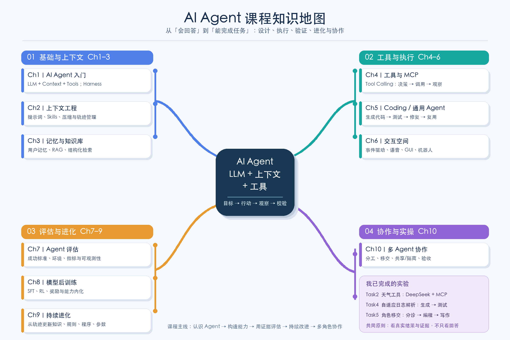

# Task 6｜AI Agent 共学总结

> 学习资料：[《AI Agent 深度理解》](https://github.com/bojieli/ai-agent-book) 第 1–10 章  
> 呈现方式：思维导图 + 实验复盘  
> 整理日期：2026 年 10 月 5 日

## 一张图看课程主线

这门课从 **Agent = LLM + 上下文 + 工具** 出发。LLM 负责理解任务和选择下一步；上下文保存目标、约束、历史和外部知识；工具让 Agent 真正读取信息、执行动作。三者由运行框架组织成循环：**目标 → 行动 → 观察 → 校验 → 下一步**。因此，评价 Agent 不能只看回答是否流畅，更要看它有没有完成任务、产生可检查的结果。

十章内容可以连成四条学习线：

1. **基础与上下文（第 1–3 章）**：认识 Agent 的组成；学习提示词、Skills、上下文压缩和轨迹管理；通过记忆与 RAG，让 Agent 使用当前任务所需的信息。
2. **工具与执行（第 4–6 章）**：理解 Tool Calling 和 MCP；让 Agent 编写并运行代码，再用测试反馈修正；把观察和动作扩展到异步事件、语音、GUI 等场景。
3. **评估与进化（第 7–9 章）**：先定义成功标准、评估环境和可观测证据，再根据运行轨迹改进知识、规则、程序，必要时进行模型后训练。
4. **多 Agent 协作（第 10 章）**：按职责分工，设计角色移交、上下文共享或隔离，以及清晰的消息和验收条件。角色变多也会带来协调成本与失败风险。

## 我完成的实验怎样串起这些概念

| 实验 | 我观察到的实际过程 | 对应的课程认识 |
|---|---|---|
| [Task2：DeepSeek + MCP 天气工具](../Task2/README.md) | 模型判断当前天气需要外部数据，调用工具，收到 Open-Meteo 结果后回答 | Tool Calling 表达调用意图，MCP 连接工具；还要检查工具返回的业务状态 |
| [Task4：自适应日志解析器](../Task4/README.md) | DeepSeek 生成解析代码，三条样本测试通过，代码热加载并持久化 | Coding Agent 的成果是经执行和测试验证的代码，而非一段“看起来正确”的文本 |
| [Task5：多角色移交](../Task5/README.md) | 分诊 → 编程 → 写作 → 分诊；Python 真正算出前 20 项斐波那契数列之和 `10945` | 协作要检查动作是否真的发生；移交本身不代表任务完成 |

这三次实操也暴露了相同的工程问题：**模型声明、工具调用和任务完成是三件不同的事**。天气工具曾因地点与网络问题失败；日志解析器必须通过测试才能被接纳；多角色实验最初两次虽然发生了移交，却没有执行代码。只有记录调用、观察结果并按预先定义的条件验收，才能确定 Agent 真正完成了工作。

## 我的学习心得

刚开始，我把 Agent 理解为“会使用工具的大模型”。学完这些章节并实际跑过实验后，我更愿意把它理解为一个有明确目标、能行动、能读取环境反馈、也能接受验证的系统。模型只是其中的决策部分；上下文、工具、权限、测试和运行记录同样决定最终效果。

对我最有用的学习方法，是每学一个概念就找一个能观察到闭环的小实验：先提出任务，再看模型做了什么，最后检查环境里留下了什么证据。下一步如果继续深入，我会优先学习第 7 章的评估方法，为同一任务设计多组输入和明确的成功条件，而不是只凭一次成功运行判断 Agent 的能力。

> **范围说明**：图中第 1–10 章是课程知识结构；上表仅列出此次共学中已留有运行记录的 Task2、Task4、Task5 实验。课程概览不表示每一章的全部实验都已复现。
